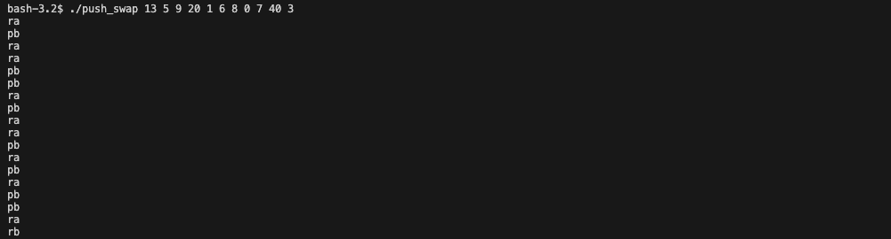

<h1 align="center">42cursus - Push_swap</h1>

<p align="center">
	
	
</p>

Push_swap is a project that involves sorting data on a stack using a limited set of instructions with the fewest possible actions. It focuses on choosing the most appropriate algorithms for an optimized data sorting.

For more projects related to 42cursus, please visit the [hive-42cursus](https://github.com/wengcychan/hive-42cursus.git) repository.

## Introduction

The goal of this project is to create a program that sorts integers on a stack. There are two stacks, named `a` and `b`, and a set of instructions to manipulate both stacks. The mission is to use `Push swap language` instructions to sort the integers the fastest way possible.



## Sorting Algorithm

The primary sorting algorithm used in this project is Quicksort.

## Usage

To use the Push_swap program, follow these steps:

1. Clone the repository to your local machine:

   ```bash
   git clone https://github.com/wengcychan/42cursus-push_swap.git

2. Compile the program:

   ```bash
	make
	```
&nbsp;&nbsp;&nbsp;&nbsp;&nbsp;&nbsp;&nbsp;&nbsp;&nbsp;&nbsp;&nbsp; This will generate an executable named `push_swap`.

3. Execute the Push_swap program using a list of integers as arguments. The program will display the optimized list of instructions to sort the stack:

   ```bash
	./push_swap 3 2 1
	```

4. Compile the bonus part:

   ```bash
	make bonus
	```
&nbsp;&nbsp;&nbsp;&nbsp;&nbsp;&nbsp;&nbsp;&nbsp;&nbsp;&nbsp;&nbsp; This will generate an executable named `checker`.

5. To verify the sorting, you can use the `checker` program. It reads and executes the instructions provided and checks if the stack is sorted properly:

   ```bash
	./push_swap 3 2 1 | ./checker 3 2 1
	```
&nbsp;&nbsp;&nbsp;&nbsp;&nbsp;&nbsp;&nbsp;&nbsp;&nbsp;&nbsp;&nbsp; If the stack is sorted, it will display "OK"; otherwise, it will display "KO".  
&nbsp;&nbsp;&nbsp;&nbsp;&nbsp;&nbsp;&nbsp;&nbsp;&nbsp;&nbsp;&nbsp; Please note that the `checker` program also supports using the standard input for instructions.